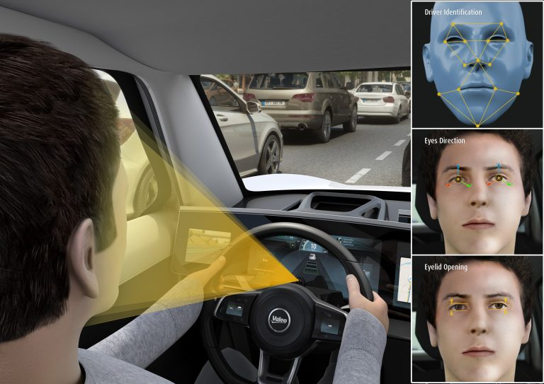

# Driver Safety Awareness project

Driver Coach System

Goals:
* Promote safe driving habits
* Raise awareness
* Change driver behaviour
* Help to prevent car accidents

The "Driver Coach" will help the driver of a car to improve its safety by providing feedback just like any regular coach. The system is based on a camera that monitors the driver's behaviour during a road trip.

When a driver enters the car he/she is automaticly recognized or a new profile is created for analyzing driver performance.
The system provides immediate feedback on positive and negative behaviour. It warns when the driver gets tired and requires a break. It immediately alerts the driver when a dangerous situation occurs, such as texting while driving). 

After each trip the system sends a summary to the driver's smartphone for quick review. When at home specific situations can be reviewed in depth with the Driving Coach App. The App will show snapshots or short video with detailed data and advise for improvement.

Monitor driver behavior:
  * Good driving habits
    * Wearing seat belt
    * Active driving posture
    * Hands on the steering wheel
    * Looking to the general driving direction
    * Checking for traffic from all directions
    * Rear mirror checking
   * Abstain from distractions
     * Mobile phone usage (handheld, call, texting)
     * Operating the radio
     * Talking to passengers
     * Eating or drinking
     * Other (looking for something)
   * Driver physics
     * Body, arm and hand position
     * Head pose (rotation, looking direction)
     * Driver drowsiness
       * Eye blinking/closed
       * Head bobbing
       * Mouth yawning
  
  
 Tools and technology
 * Technology
    * Head Pose estimation
    * Face location, Face landmarks, Driver recognition
    * Image classification of dangerous situations
 *   OpenCV (CV2), Dlib, fast.ai
 * Tools
    * Python-video-annotator [code](https://github.com/chan0park/video-annotation-tool) / [documentation](https://pythonvideoannotator.readthedocs.io/en/master/index.html)
    * UAH DriveSet Reader [git](https://github.com/Tauvic/uah_driveset_reader)
 * Datasets
    * Eyeblink8 [dataset](https://www.blinkingmatters.com/research)
 * Example code:
    * Aontoine Lame GazeTracking [code](https://github.com/antoinelame/GazeTracking)
    * CNN Human face detector [model](http://arunponnusamy.com/files/mmod_human_face_detector.dat)
    * Example [code](https://github.com/spmallick/dlib)