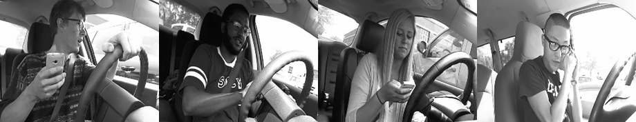
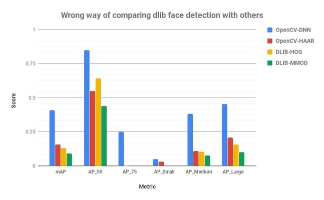

# The Safe Driver Coaching System

## A personal driving coach can make driving 57% safer

**``Note: Work on this project started in november 2020 and is still incomplete and under construction``**

Strangely enough dangerous driving such as speeding and hard breaking is NOT the main cause of accidents.
Of all car accidents 94 percent are caused by driver error and 57 percent by distracted driving.
The idea is monitor and improve driving style to reduce injuries and damages.

The driver coach system will check for all safety aspects (360 degrees 3D aspects):

* Warn for [Distractions](https://github.com/Tauvic/DriverAwareness/wiki/Distractions) (eating, drinking, phone usage :telephone_receiver:, loud music :musical_note:)
* Alert for [Drowsiness](https://github.com/Tauvic/DriverAwareness/wiki/Drowsiness) (tired driver :zzz: wakeup sound :speaker:)
* Improve your [Driving skills](https://github.com/Tauvic/DriverAwareness/wiki/Driving-Maneuvers) (situational awareness, mirror checking)

What's new in this approach is the idea of providing each driver with an AI based personal driving coach. The driving coach combines the knowledge of a group of expert driving coaches, assesses your driving and provides valuable feedback to make driving safer. As far as i know there is currently no system that monitors the driver while executing vehicle maneuvers.

**The objective is to make driving safer by developing an affordable personal driving coach. Therefore I open sourced this plan and its code and hope others including companies and organisations will step in and adopt it.**

Approach:
* Get more people involved in the project (developers, safety experts, evangelists, test dummies)
* Verify that the idea is sound and can result in an affordable and fully functioning solution
* Develop a working demonstration to show its capabilities
* Develop software components and building blocks (software libraries, hardware design, system configurations)
* Open source the idea, plans, methods and software libraries
* Broadcast the idea, get organisations involved
* Deliver a device that can do the job and is afforable for everyone

There is a path from idea to a working solution that has to be discovered. This requirers significant effort and expertise. I hope people will step in to join. Organisations can join to and decide to contribute to he project or step out at some time and continue on their own. All for the greater good of mankind and ethernal glory.

_You can find the plan in the [project wiki](https://github.com/Tauvic/DriverAwareness/wiki)
a link to the [presentation](https://docs.google.com/presentation/d/e/2PACX-1vRHttK1QIrXpzs1W75Ems-VAGZeEljflD4uH83o5VFrHQ5IMb9apDvCATzksJKMjitwCM8x3FE2rOyq/pub?start=true&loop=false&delayms=60000)
, ongoing activities in [project](https://github.com/Tauvic/DriverAwareness/projects/1). Any help is welcome._

## How can we make driving safer for every one? 
<a href="https://www.youtube.com/watch?v=uJ4w63wZyFQ"><a>
Its so easy to get distracted when your loved on sits next to you in the car or when you start day dreaming. 
The "Driver Coach" is a smart system installed in your car that will provide feedback just like any regular driving coach. 
The system is based on a camera, sensors and machine learning that monitor the driver's behaviour during a road trip. 
It will evaluate how you act as a driver in specific circumstances. For example how you prepare for a turn by checking your mirrors.
It will also monitor for driver drowsiness and warn you to take a break.
   
Note: the video shows Rick August and his safe driving instruction video's. We cannot put a Rick next to every driver. But we try to provide useful feedback to every driver  [Rick August: Smart Drive Test video](https://www.youtube.com/c/Smartdrivetest)

## The business case
Currently most car lease and insurance companies focus on reduction of aggressive driving habits (speeding or hard breaking).
They provide their customers with Apps that use Smartphone sensors for tracking vehicle location and acceleration.
But this approach does not cover all aspects (distraction,drowsiness and driving maneuvers) and is therefore less effective to reduce accidents. Drivers usually know when they have aggressive driving habits. and aggressive drivers are usually not willing to change their habits. But cautious drivers are the majority and they are willing to learn and improve their driving skills in order to make their life safer. From a safety perspective the driver is better helped with a system that monitors driver alertness, warns them in potential dangerous situations and provides useful feedback for improving driving skills. This will reduce their chance of getting into an accident with 57 percent.

How can we get the best for everyone? Companies that care about social responsibility to their customers should consider all previous arguments and 
design a system that provides real benefits for their customers.
Such a system is however more complex and costly to develop and implement. An open source solution might be helpful to reduce cost if its flexible enough to be adapted to specific requirements.

**So the main question is: How can we develop an affordable and flexible solution that provides benefits for all**

|Consumer|Business case|
|----------|-----------|
|* Promote safe driving habits|* Car lease (safety as a service, reduce car accidents)
| * Improve safe driving behaviour|* Insurance (reduce car accidents)
| * Help to prevent car accidents|* Road service organizations (safety for its members)
| * Make Driver Monitoring systems available for low cost|* Driving school (better feedback, better results)
| * Lower costs for society|
| * While keeping privacy|

A good starting point to introduce this system would be driving schools.
They could use these devices in their daily practice and lend them to their customers when they practice under parental supervision. 
By lending them to young drivers on training, consumers will getting used to these devices and this will lead to general acceptance.

# How to get user acceptance
I think the biggest challenge is to convince people to use these kind of systems. 
Acceptance depends on two factors: how effective it is in making driving safe and if we can trust the system behind it.
The effectiveness has to be proven with field trials and the results must be verified and reported to the public.

We all have our thoughts on devices that observe us especially when we are making errors. Everything the system does should therefore be crystal clear:

* How does it work
* What kind of data is being processed
* How does it make its decisions (criteria)
* What will be done with conclusions
* Who owns this data and has control over it
* Can i put my trust in this system

Everyone has to make up their own mind and decide:

**Do I want to assess and improve my driving skills in order to make driving safe for myself and the people around me.**

I personally hope that we can make driving safer. My wife lost her father in a road accident and every life is valuable and worth saving. 

To get user acceptance I propose to publish the general design of the system so people can understand how it works and what it does.
A further assurance might be an independent auditor or trustworthy organisation, auditing the final product and a statement that the product does what is promises.

# How to develop and implement

## How the system works

When a driver enters the car he/she is automatically recognized with face recognition.
During the trip the system continuously determines the actual driving situation (parked, cruising, braking, turning) and evaluates the drivers activity and behaviour.
It provides an audible warning when the driver gets tired and requires a break.
It immediately alerts the driver when a dangerous situation occurs, such as changing direction without signaling or texting while driving. 

After each trip the system sends a summary to the driver's smartphone for quick review. 
When at home specific situations can be reviewed in depth with the Driving Coach App. 
The App will show snapshots or short video with detailed data and advise for improvement.

The collected data is kept on the device under full control of the driver and can be deleted when required.
Data can be shared with selected parties for specific applications such as an insurance company or a safe driver leader board  where drivers can compare themselves with other drivers.

## Following a step by step approach

The plan is to setup a demo to verify its feasibility, then to develop a prototype for field testing to investigate its effectiveness.

Developing a driver monitoring system is not a trivial task, and there are several ways to get there. 
The easiest is of course just to buy such a system from a reliable supplier or develop one using a toolkit. 
But this may be expensive or not suit your needs. And how do you get the expertise to choose the right solution?
I decided to try to develop one myself to see how far I can come. Its an interesting project.

* Develop a basic prototype
    * learn more about the subject of safe driving, sensors, data processing, machine learning
    * build a proof of concept based on a simple system such as laptop / webcam / smartphone
    * find out if its possible to develop the POC into a cost effective solution
    * demonstrate its capabilities
* If this first step succeeds, try to interest parties to actually further develop and use such systems
* If not then I have lost nothing and learned a lot.

For now im evaluating some vision and machine learning toolkits such as [OpenCV](https://opencv.org/), [Microsoft OpenVino](https://docs.openvinotoolkit.org/latest/index.html) and [Google MediaPipe](https://google.github.io/mediapipe/). 
Deployment on Smartphone or IoT devices such as [Coral Dev Board](http://coral.ai), [Jetson Nano](https://developer.nvidia.com/embedded/jetson-nano-developer-kit)
 

## Monitoring driver behavior

  * Good driving habits
    * Wearing seat belt
    * Active driving posture
    * Hands on the steering wheel
    * Looking to the general driving direction
    * Checking for traffic from all directions
    * Left/right/rear mirror checking
    * Signalling direction changes to other drivers
   * Abstain from distractions
     * Mobile phone usage (handheld, call, texting)
     * Operating the console (radio / airco)
     * Talking to passengers
     * Eating or drinking
     * Other (reaching for something, singing)
   * Driver physics
     * Body, arm and hand position
     * Head pose (rotation, looking direction)
     * Driver drowsiness
       * Eye blinking/closed
       * Head bobbing
       * Mouth yawning
  
  
  

 ## Challenges
 
 * System design
     * Specifications (domain knowledge
     * Determine actual driving state based on sensor data
     * Combine driving state with driver activity and evaluate its behavior (scoring)
 * System limitations (processing power, battery consumption, operating system)
 * Physical conditions
    * Lighting conditions
    * Vibrations
    * Mounting (where, how, car types)
 * Calibration & Testing (test data)
 * Ethical and legal issues
 
 
## Tools and technology

<a href="https://www.youtube.com/watch?v=vAxRe8uPS3s"><a>
Note: the video is not the final product but included here to get a first impression ([Driver monitoring system from EyeSight](https://www.eyesight-tech.com))
 
 * Driver Sensors
    * Face location (is there a driver)
    * Driver recognition (who is driving)
    * Head Pose estimation (looking direction)
    * Face landmarks (eyes, mouth)
    * Hand location (on steering wheel)
    * Image classification of dangerous situations
 * Vehicle sensors
    * Acceleration (left/right turn, breaking)
    * Vehicle speed
 * Tools
    * Python, OpenCV (CV2), Dlib, fast.ai
    * Python-video-annotator [code](https://github.com/chan0park/video-annotation-tool) / [documentation](https://pythonvideoannotator.readthedocs.io/en/master/index.html)
    * UAH DriveSet Reader [git](https://github.com/Tauvic/uah_driveset_reader)
 * Datasets
    * StateFarm Distracted Driver dataset [link](https://www.kaggle.com/c/state-farm-distracted-driver-detection)
    * Eyeblink8 [dataset](https://www.blinkingmatters.com/research)
    * Columbia Gaze DataSet [link](https://www.cs.columbia.edu/CAVE/databases/columbia_gaze/)
    * DMD - Driving Monitoring Dataset [link](https://dmd.vicomtech.org/)
 * Example solutions
   * Futurebridge [link](https://www.futurebridge.com/blog/driver-monitoring-from-essential-safety-to-passenger-wellness/)
 * Example code:
    * Learn Open CV Examples [code](https://github.com/spmallick/dlib)
    * Brain4Cars technical research [website](http://brain4cars.com/)
    * Ground AI Real-Time Driver State Monitoring
                Using a CNN Based Spatio-Temporal Approach*
[link](https://www.groundai.com/project/real-time-driver-state-monitoring-using-a-cnn-based-spatio-temporal-approach/1)
    * Gaurav Shadev Drowsiness Detection [github](https://github.com/Gauravsahadev/Drowsiness-detection-and-alert-system-DDAS-)
    * Aontoine Lame GazeTracking [code](https://github.com/antoinelame/GazeTracking)
    * CNN Human face detector [model](http://arunponnusamy.com/files/mmod_human_face_detector.dat)
    * [DBSE-Monitor](https://github.com/altaga/DBSE-monitor)
    
    Selecting the best face detection method:
    Source: Face Detection – OpenCV, Dlib and Deep Learning ( C++ / Python ) [link](https://www.learnopencv.com/face-detection-opencv-dlib-and-deep-learning-c-python/)
    
