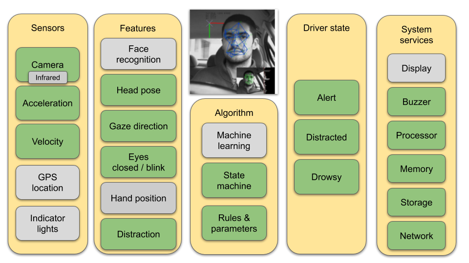

# The business case: Safe Driver Coaching System

## Why we all should have our personal driving coach

Strangely enough dangerous driving such as speeding and hard breaking is NOT the main cause of accidents.
Of all car accidents 94 percent are caused by driver error and 57 percent by distracted driving.
A system that helps the driver to focus its attention on driving can reduce injuries and damages.
My objective is to develop an affordable personal driving coach that will help the driver to improve its driving.
There fore I open sourced this plan and its code and hope others including companies and organisations will step in and adopt it.

## How can we make driving safer for every party involved? 

Its so easy to get distracted when your loved on sits next to you in the car or when you start day dreaming. 
The "Driver Coach" is a system that will help the driver of a car to improve its safety by providing feedback just like any regular coach. 
The system is based on a camera and sensors that monitor the driver's behaviour during a road trip. 
It will check for driver drowsiness but also for active signs of alertness such as frequent mirror checking especially when changing direction. 

Currently most car lease and insurance companies focus on the detection of a limited set of dangerous driving situations such as speeding, cornering and hard breaking. 
They provide their customers with Apps that use Smartphone sensors for tracking vehicle location and acceleration.
This approach provides valuable information for determining insurance risk on an individual base and is relative cheap and easy to implement.

Drivers usually know when they have aggresive driving habits (speeding or hard breaking).
From a safety perspective the driver is better helped with a system that monitors driver alertness and warns him in potential dangerous situations.
This will reduce their chance of getting an accident with 57 percent.

How can we get the best for everyone? Companies that care about social responsibility to their customers should consider all previous arguments and 
design a system that provides real benefits for their customers.
Such a system is however more complex and costly to develop and implement. An open source solution might be helpful to reduce cost if its flexible enough to be adapted to specific requirements.

**So the main question is: How can we develop an affordable and flexible solution that provides benefits for all**

|Consumer|Business case|
|----------|-----------|
|* Promote safe driving habits|* Car lease (safety as a service, reduce car accidents)
| * Improve safe driving behaviour|* Insurance (reduce car accidents)
| * Help to prevent car accidents|* Road service organizations (safety for its members)
| * Make Driver Monitoring systems available for low cost|* Driving school (better feedback, better results)
| * Lower costs for society|

A good starting point would be Driving schools, they could use these devices in their daily practice. 
And lend them to their customers when they practice under parental supervision. By lending them to young drivers on training, consumers will getting used to these devices and this will lead to general acceptance.

# How to develop and implement

## How the system works

When a driver enters the car he/she is automatically recognized with face recognition.
During the trip the system continuously determines the actual driving situation (parked, cruising, braking, turning) and evaluates the drivers activity and behaviour.
It provides an audible warning when the driver gets tired and requires a break.
It immediately alerts the driver when a dangerous situation occurs, such as changing direction without signaling or texting while driving. 

After each trip the system sends a summary to the driver's smartphone for quick review. 
When at home specific situations can be reviewed in depth with the Driving Coach App. 
The App will show snapshots or short video with detailed data and advise for improvement.

The collected data is kept on the device under full control of the driver and can be deleted when required.
Data can be shared with selected parties for specific applications such as an insurance company or a safe driver leader board  where drivers can compare themselves with other drivers.

## Following a step by step approach

The plan is to setup a demo to verify its feasibility, then to develop a prototype to further investigate requirements.

Developing a driver monitoring system is not a trivial task, and there are several ways to get there. 
The easiest is of course just to buy such a system from a reliable supplier or develop one using a toolkit. 
But this may be expensive or not suit your needs. And how do you get the expertise to choose the right solution?
I decided to try to develop one myself to see how far I can come. Its an interesting project.

* Develop a basic prototype
    * learn more about the subject of safe driving, sensors, data processing, machine learning
    * build a proof of concept based on a simple system such as laptop / webcam / smartphone
    * find out if its possible to develop the POC into a cost effective solution
    * demonstrate its capabilities
* If this first step succeeds, try to interest parties to actually further develop and use such systems
* If not then I have lost nothing and learned a lot.

For now im evaluating some vision and machine learning toolkits such as [OpenCV](https://opencv.org/) and [Google MediaPipe](https://google.github.io/mediapipe/). 
Deployment on Smartphone or IoT devices such as [Coral Dev Board](http://coral.ai)
 

## Monitoring driver behavior

  * Good driving habits
    * Wearing seat belt
    * Active driving posture
    * Hands on the steering wheel
    * Looking to the general driving direction
    * Checking for traffic from all directions
    * Left/right/rear mirror checking
    * Signalling direction changes to other drivers
   * Abstain from distractions
     * Mobile phone usage (handheld, call, texting)
     * Operating the console (radio / airco)
     * Talking to passengers
     * Eating or drinking
     * Other (reaching for something, singing)
   * Driver physics
     * Body, arm and hand position
     * Head pose (rotation, looking direction)
     * Driver drowsiness
       * Eye blinking/closed
       * Head bobbing
       * Mouth yawning
  
  
  

 ## Challenges
 
 * System design
     * Specifications (domain knowledge
     * Determine actual driving state based on sensor data
     * Combine driving state with driver activity and evaluate its behavior (scoring)
 * System limitations (processing power, battery consumption, operating system)
 * Physical conditions
    * Lighting conditions
    * Vibrations
    * Mounting (where, how, car types)
 * Calibration & Testing (test data)
 * Legal issues
 
 
## Tools and technology
 
 * Driver Sensors
    * Face location (is there a driver)
    * Driver recognition (who is driving)
    * Head Pose estimation (looking direction)
    * Face landmarks (eyes, mouth)
    * Hand location (on steering wheel)
    * Image classification of dangerous situations
 * Vehicle sensors
    * Acceleration (left/right turn, breaking)
    * Vehicle speed
 * Tools
    * Python, OpenCV (CV2), Dlib, fast.ai
    * Python-video-annotator [code](https://github.com/chan0park/video-annotation-tool) / [documentation](https://pythonvideoannotator.readthedocs.io/en/master/index.html)
    * UAH DriveSet Reader [git](https://github.com/Tauvic/uah_driveset_reader)
 * Datasets
    * StateFarm Distracted Driver dataset [link](https://www.kaggle.com/c/state-farm-distracted-driver-detection)
    * Eyeblink8 [dataset](https://www.blinkingmatters.com/research)
    * Columbia Gaze DataSet [link](https://www.cs.columbia.edu/CAVE/databases/columbia_gaze/)
    * DMD - Driving Monitoring Dataset [link](https://dmd.vicomtech.org/)
 * Example solutions
   * Futurebridge [link](https://www.futurebridge.com/blog/driver-monitoring-from-essential-safety-to-passenger-wellness/)
 * Example code:
    * Learn Open CV Examples [code](https://github.com/spmallick/dlib)
    * Brain4Cars technical research [website](http://brain4cars.com/)
    * Ground AI Real-Time Driver State Monitoring
                Using a CNN Based Spatio-Temporal Approach*
[link](https://www.groundai.com/project/real-time-driver-state-monitoring-using-a-cnn-based-spatio-temporal-approach/1)
    * Gaurav Shadev Drowsiness Detection [github](https://github.com/Gauravsahadev/Drowsiness-detection-and-alert-system-DDAS-)
    * Aontoine Lame GazeTracking [code](https://github.com/antoinelame/GazeTracking)
    * CNN Human face detector [model](http://arunponnusamy.com/files/mmod_human_face_detector.dat)
    
    Selecting the best face detection method:
    Source: Face Detection – OpenCV, Dlib and Deep Learning ( C++ / Python ) [link](https://www.learnopencv.com/face-detection-opencv-dlib-and-deep-learning-c-python/)
    
